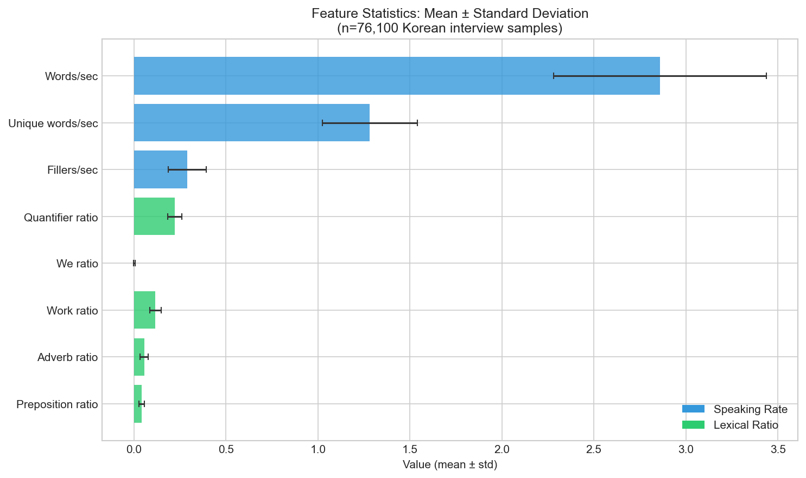
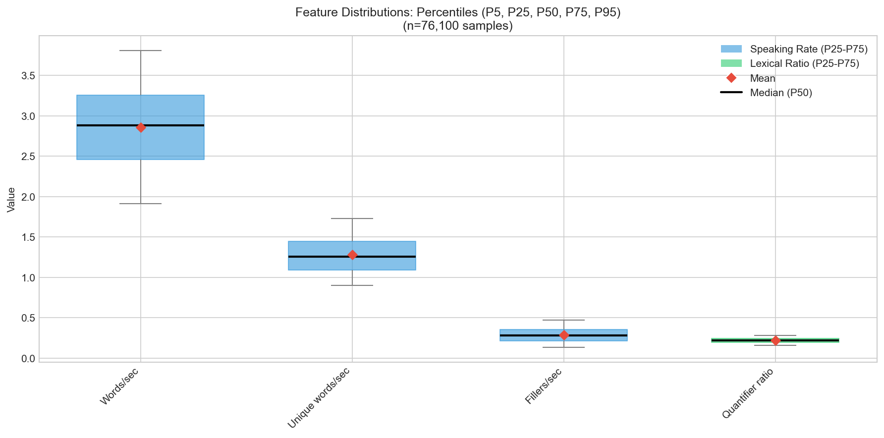
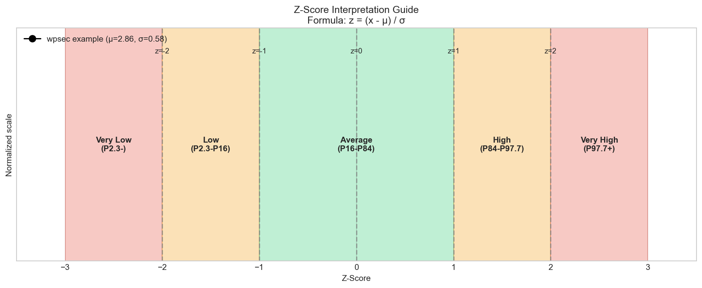
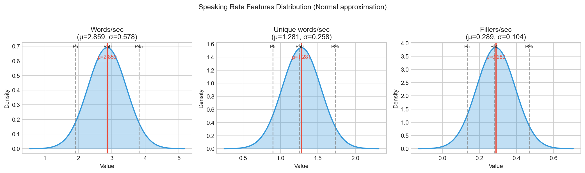
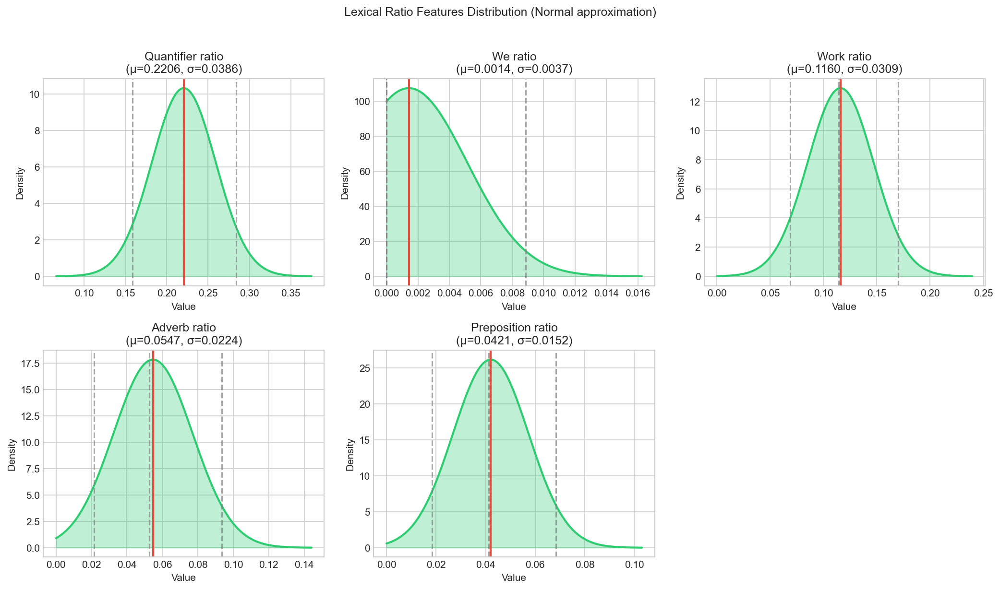
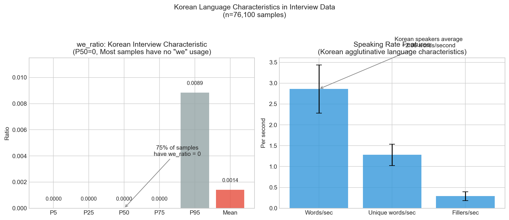

# Feature Statistics Report

Statistics calculated from 76,100 Korean interview samples for ko-liwc feature extraction.

## 1. Dataset Overview

| Metric | Value |
|--------|-------|
| Total Files | 76,106 |
| Processed | 76,100 (99.99%) |
| Skipped | 6 |
| Generated | 2025-12-02 |
| Source | Korean interview transcripts |

## 2. Target Features (8 Features from Naim et al. 2018)

### 2.1 Statistics Summary Table

| Feature | Mean | Std | Min | Max | P5 | P50 | P95 |
|---------|------|-----|-----|-----|-----|-----|-----|
| wpsec | 2.859 | 0.578 | 0.867 | 5.274 | 1.912 | 2.880 | 3.810 |
| upsec | 1.281 | 0.258 | 0.485 | 3.673 | 0.899 | 1.256 | 1.732 |
| fpsec | 0.289 | 0.104 | 0.000 | 0.759 | 0.134 | 0.281 | 0.470 |
| quantifier_ratio | 0.221 | 0.039 | 0.041 | 0.400 | 0.159 | 0.220 | 0.284 |
| we_ratio | 0.001 | 0.004 | 0.000 | 0.061 | 0.000 | 0.000 | 0.009 |
| work_ratio | 0.116 | 0.031 | 0.000 | 0.290 | 0.069 | 0.114 | 0.170 |
| adverb_ratio | 0.055 | 0.022 | 0.000 | 0.211 | 0.021 | 0.053 | 0.093 |
| preposition_ratio | 0.042 | 0.015 | 0.000 | 0.124 | 0.018 | 0.041 | 0.068 |

### 2.2 Feature Mean ± Standard Deviation



### 2.3 Percentile Distribution (P5-P95)



## 3. Z-Score Interpretation Guide

### 3.1 Z-Score Range Visualization



### 3.2 Z-Score Threshold Table

| Z-Score | Interpretation | Percentile | wpsec Example |
|---------|----------------|------------|---------------|
| z > +2 | Very High | P97.7+ | > 4.01 words/sec |
| z > +1 | High | P84+ | > 3.44 words/sec |
| z ≈ 0 | Average | P50 | ≈ 2.86 words/sec |
| z < -1 | Low | P16- | < 2.28 words/sec |
| z < -2 | Very Low | P2.3- | < 1.70 words/sec |

### 3.3 Z-Score Formula

```
z = (x - μ) / σ
```

Where:
- `x`: observed value
- `μ`: population mean
- `σ`: population standard deviation

### 3.4 Feature-Specific Z-Score Thresholds

| Feature | μ (Mean) | σ (Std) | z=-2 | z=-1 | z=+1 | z=+2 |
|---------|----------|---------|------|------|------|------|
| wpsec | 2.859 | 0.578 | 1.70 | 2.28 | 3.44 | 4.01 |
| upsec | 1.281 | 0.258 | 0.77 | 1.02 | 1.54 | 1.80 |
| fpsec | 0.289 | 0.104 | 0.08 | 0.18 | 0.39 | 0.50 |
| quantifier_ratio | 0.221 | 0.039 | 0.14 | 0.18 | 0.26 | 0.30 |
| we_ratio | 0.001 | 0.004 | -0.01* | -0.00 | 0.01 | 0.01 |
| work_ratio | 0.116 | 0.031 | 0.05 | 0.09 | 0.15 | 0.18 |
| adverb_ratio | 0.055 | 0.022 | 0.01 | 0.03 | 0.08 | 0.10 |
| preposition_ratio | 0.042 | 0.015 | 0.01 | 0.03 | 0.06 | 0.07 |

*Negative values should be clipped to 0 for ratio features.

### 3.5 Lexical Feature 평가 기준 (Good/Bad Judgment)

SVR 모델 가중치 방향에 따른 특성별 평가 기준입니다.

#### 가중치 방향 (Weight Direction)

| 방향 | Features | 해석 |
|------|----------|------|
| **양수 (+)** | wpsec, upsec, quantifier, we, work, adverb, preposition | z↑ = 점수↑ (높을수록 좋음) |
| **음수 (-)** | fpsec | z↓ = 점수↑ (낮을수록 좋음) |

> ⚠️ **핵심**: `fpsec`만 유일하게 **낮을수록 좋음** (필러가 적다 = 유창함)

#### 평가 기준표 (Evaluation Thresholds)

| Feature | 미흡 (z<-1) | 평균 (-1≤z≤+1) | 우수 (z>+1) | 평가 방향 |
|---------|-------------|----------------|-------------|----------|
| wpsec | < 2.28 words/s | 2.28 ~ 3.44 | > 3.44 words/s | ↑ 높을수록 좋음 |
| upsec | < 1.02 words/s | 1.02 ~ 1.54 | > 1.54 words/s | ↑ 높을수록 좋음 |
| **fpsec** | **> 0.39** ❌ | 0.18 ~ 0.39 | **< 0.18** ✅ | ↓ **낮을수록 좋음** |
| quantifier_ratio | < 0.18 | 0.18 ~ 0.26 | > 0.26 | ↑ 높을수록 좋음 |
| we_ratio | - | ≈ 0 (대부분) | > 0.005 | ↑ (희소, 한국어 특성) |
| work_ratio | < 0.09 | 0.09 ~ 0.15 | > 0.15 | ↑ 높을수록 좋음 |
| adverb_ratio | < 0.03 | 0.03 ~ 0.08 | > 0.08 | ↑ 높을수록 좋음 |
| preposition_ratio | < 0.03 | 0.03 ~ 0.06 | > 0.06 | ↑ 높을수록 좋음 |

#### 평가 코드 예시

```python
from ko_liwc.scoring.normalizer import DEFAULT_FEATURE_STATS

# 음수 가중치 특성 (낮을수록 좋음)
NEGATIVE_WEIGHT_FEATURES = {"fpsec"}

def evaluate_feature(name: str, z_score: float) -> str:
    """Z-Score 기반 특성 평가 (가중치 방향 고려)"""

    # fpsec은 방향 반전 (낮을수록 좋음)
    if name in NEGATIVE_WEIGHT_FEATURES:
        if z_score < -1:
            return "우수 ✅"  # 필러 적음
        elif z_score > 1:
            return "미흡 ❌"  # 필러 많음
        else:
            return "평균"
    else:
        # 나머지 7개: 높을수록 좋음
        if z_score > 1:
            return "우수 ✅"
        elif z_score < -1:
            return "미흡 ❌"
        else:
            return "평균"

# 사용 예시
z_scores = {"wpsec": 1.5, "fpsec": -0.8, "work_ratio": 0.3}
for name, z in z_scores.items():
    print(f"{name}: z={z:.2f} → {evaluate_feature(name, z)}")
# wpsec: z=1.50 → 우수 ✅
# fpsec: z=-0.80 → 평균
# work_ratio: z=0.30 → 평균
```

## 4. Feature Distribution Visualization

### 4.1 Speaking Rate Features



**Observations:**
- **wpsec (Words per second)**: Mean 2.86, normally distributed
- **upsec (Unique words per second)**: Mean 1.28, tight distribution
- **fpsec (Fillers per second)**: Mean 0.29, right-skewed (some samples have no fillers)

### 4.2 Lexical Ratio Features



**Observations:**
- **quantifier_ratio**: Highest mean (0.22), consistent across samples
- **we_ratio**: Very low mean (0.001), most samples have 0
- **work_ratio**: Second highest (0.12), work-related vocabulary common in interviews
- **adverb_ratio**: Moderate (0.05), consistent distribution
- **preposition_ratio**: Lower (0.04), agglutinative language characteristic

## 5. Korean Language Characteristics

### 5.1 Key Findings Visualization



### 5.2 Analysis

#### 5.2.1 Speaking Rate (wpsec = 2.86 words/sec)

Korean speakers in interviews average approximately 2.86 words per second. This is higher than typical English interview data due to:

1. **Agglutinative Language**: Korean attaches multiple morphemes to word stems
2. **Word Boundary Definition**: Depends on tokenization method
3. **Interview Context**: Formal speech tends to be more measured

#### 5.2.2 First Person Plural Pronoun (we_ratio = 0.001)

The extremely low `we_ratio` is a distinctive characteristic of Korean interview data:

- **P50 (Median) = 0**: Most samples have zero "we" usage
- **P75 = 0**: 75% of samples have no "we" pronouns
- **Cultural Factor**: Korean interviews emphasize individual rather than collective framing
- **Pronoun Drop**: Korean frequently omits pronouns when context is clear

#### 5.2.3 Filler Rate (fpsec = 0.29/sec)

Filler usage patterns:
- Mean of 0.29 fillers per second
- Higher rates may indicate hesitation or cognitive load
- Lower rates in rehearsed or scripted responses

#### 5.2.4 Quantifier Ratio (quantifier_ratio = 0.22)

Higher than expected quantifier usage:
- Includes words like "많이" (many), "조금" (little), "모든" (all)
- Common in interview explanations and descriptions

## 6. Normalization Recommendations

### 6.1 Recommended: Z-Score Normalization

Z-Score normalization is recommended for SVR models (as per Naim et al. 2018):

```python
from ko_liwc.scoring import ZScoreNormalizer

# Using pre-calculated statistics
normalizer = ZScoreNormalizer(preset_stats=DEFAULT_FEATURE_STATS)

# Transform features
features = {"wpsec": 3.0, "fpsec": 0.3, ...}
normalized = normalizer.transform(features)
# wpsec: (3.0 - 2.859) / 0.578 = 0.244 (slightly above average)
```

### 6.2 Alternative: Min-Max Normalization

For [0, 1] bounded output:

```python
from ko_liwc.scoring import MinMaxNormalizer

normalizer = MinMaxNormalizer(preset_ranges=DEFAULT_FEATURE_RANGES)
normalized = normalizer.transform(features)
```

### 6.3 Usage Example

```python
from ko_liwc import InterviewAnalyzer
from ko_liwc.scoring import ZScoreNormalizer
from ko_liwc.scoring.normalizer import DEFAULT_FEATURE_STATS

# Extract features
analyzer = InterviewAnalyzer()
features = analyzer.extract_features(text, duration_seconds)

# Normalize
normalizer = ZScoreNormalizer(preset_stats=DEFAULT_FEATURE_STATS)
z_scores = normalizer.transform(features)

# Interpret
for name, z in z_scores.items():
    if z > 2:
        print(f"{name}: Very High")
    elif z > 1:
        print(f"{name}: High")
    elif z < -2:
        print(f"{name}: Very Low")
    elif z < -1:
        print(f"{name}: Low")
    else:
        print(f"{name}: Average")
```

## 7. Data Source

Statistics calculated from the `test_data` directory containing 76,106 Korean interview transcript JSON files. Each file contains:

- Interview response text
- Audio duration in milliseconds
- Metadata

Processing pipeline:
1. Extract text and duration from JSON
2. Run `InterviewAnalyzer.extract_features()`
3. Calculate streaming statistics using Welford's algorithm
4. Estimate percentiles using reservoir sampling (n=10,000)

## 8. References

- Naim, I., Tanveer, M. I., Gildea, D., & Hoque, M. E. (2018). Automated analysis and prediction of job interview performance. IEEE Transactions on Affective Computing.
- LIWC (Linguistic Inquiry and Word Count) - Pennebaker et al.
